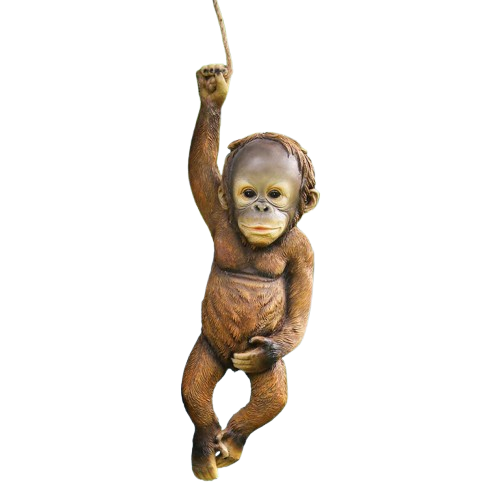

<!DOCTYPE html>
<html lang="en">
<head>
    <meta charset="UTF-8" />
    <meta name="viewport" content="width=device-width, initial-scale=1" />
    <title>Bouncing Text Box with Cursor Image and Guestbook</title>
    
</head>
<body>
    
Click for good luck!

    <!-- Replace src with your transparent monkey cursor PNG path -->
   

    

        
Guestbook

        
Monkey

        
Cat

    

    <!-- Hidden cat image -->
    

    <!-- GIF display container -->
    

        <button onclick="hideGif()" style="display: block; margin-bottom: 8px; cursor:pointer;">Close GIF</button>
        
    

    
</body>
</html>
