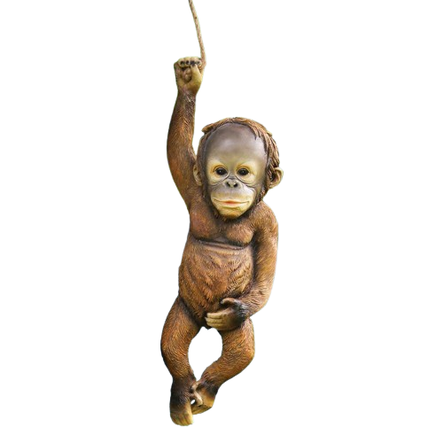

<html lang="en">
<head>
    <meta charset="UTF-8" />
    <meta name="viewport" content="width=device-width, initial-scale=1" />
    <title>Bouncing Text Box with Cursor Image and Guestbook</title>
    
</head>
<body>
    
Click for good luck!

    

    

        
Guestbook

        
Monkey

        
Cat

    

    

    

        <button onclick="hideGif()" style="display: block; margin-bottom: 8px; cursor:pointer;">Close GIF</button>
        
    

    <!-- Tic Tac Toe -->
    

        

        <button id="reset-button">Reset</button>
    

    <!-- Coin Flip -->
    

        
Flip me!

        <button id="flip-button">Flip Coin</button>
    

    <!-- Train Mission Tracker -->
    <button id="trains-button" onclick="toggleTrainsPanel()">Trains</button>

    

        <button class="train-close" onclick="toggleTrainsPanel()">X</button>
        <h2>Train Missions</h2>
        

        

    

    
</body>
</html>
